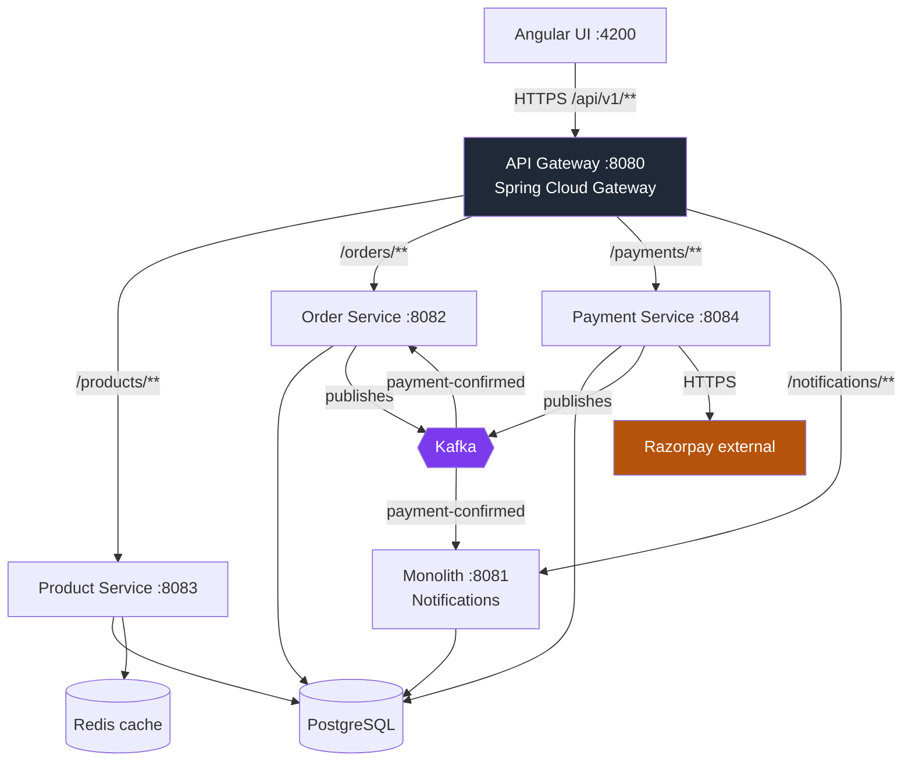
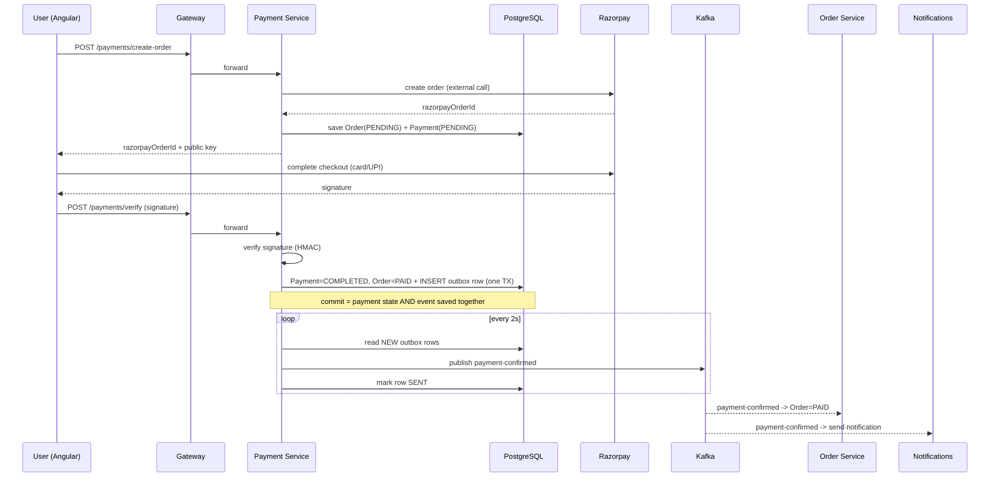
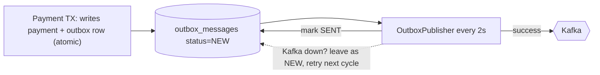
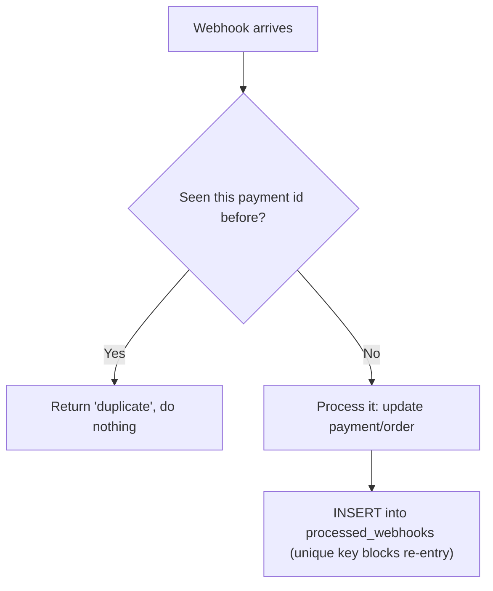
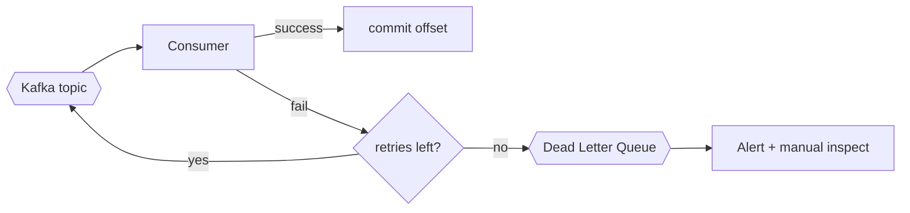
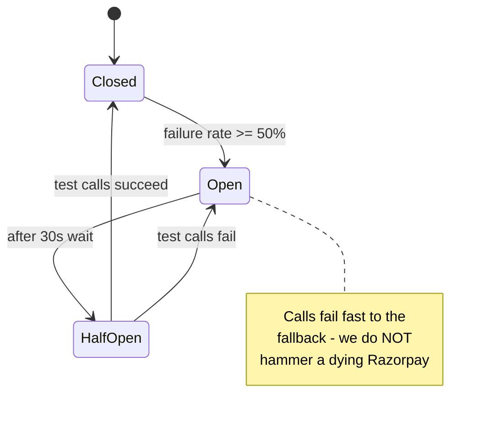
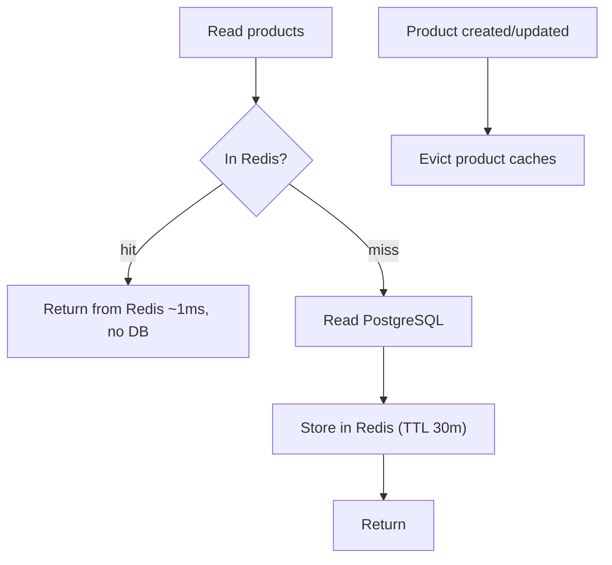
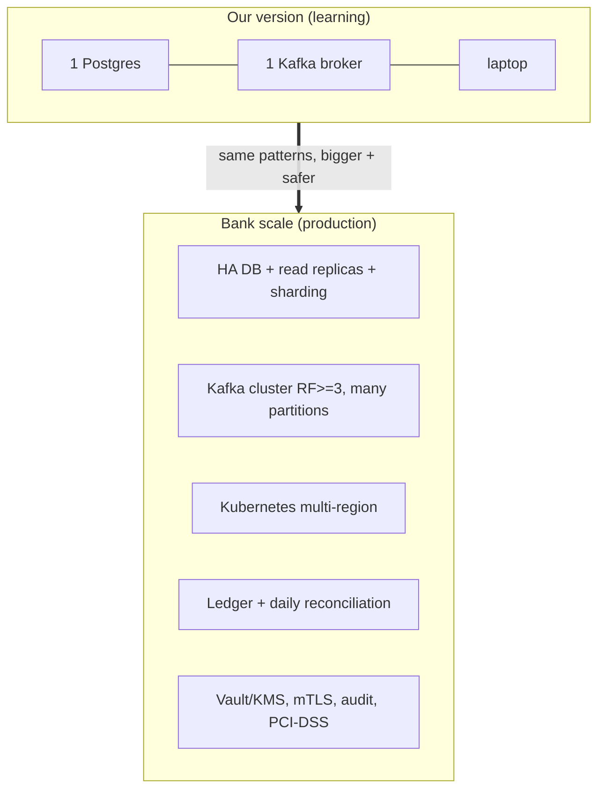

# EBusiness Platform — Deep-Dive Study Guide

> You built every piece of this. This guide explains **what** each part does, **why** it
> exists, **how** it survives failure, and **how it would scale to bank size**. Read it
> slowly. By the end you should be able to draw the architecture on a whiteboard and
> defend every arrow for ten minutes. That is exactly what a senior interviewer wants.

---

## 0. A note before you start

If you can understand this document, you can pass these interviews. None of this is
magic — it is a small number of patterns (idempotency, outbox, circuit breaker,
cache-aside) applied carefully. You already applied them. The only gap between you and
the offer is being able to **explain them calmly**. That is a learnable skill, and this
guide is your script.

---

## 1. The big picture

We took one monolith and split it into **four focused services** behind a single front
door (the API Gateway). Each service owns one job.



**One sentence per box:**

| Component | Job |
|---|---|
| **API Gateway (8080)** | Single entry point. Routes each URL path to the right service. The only port the browser knows. |
| **Product Service (8083)** | Owns the catalog. Reads are cached in Redis. |
| **Order Service (8082)** | Owns orders. Listens for `payment-confirmed` and flips the order to PAID. |
| **Payment Service (8084)** | Talks to Razorpay, verifies webhooks, writes payment state, publishes events via an **outbox**. |
| **Monolith (8081)** | Now only sends notifications ("SMS") when a payment succeeds. |
| **PostgreSQL** | Durable source of truth. |
| **Redis** | Fast cache for catalog reads. |
| **Kafka** | The async nervous system — carries events between services. |

---

## 2. How the services communicate

There are **two** communication styles, and knowing *when we use which* is a classic
interview question.

### 2a. Synchronous (request/response) — through the Gateway

The browser never talks to a service directly. It calls the gateway, which forwards the
request. This is used when the caller **needs an answer right now** (show me products,
create my payment order).

```
Browser -> Gateway :8080 -> Payment Service :8084 -> (answer) -> Gateway -> Browser
```

Why a gateway at all?
- **One URL, one CORS policy, one place for auth** instead of the browser juggling four ports.
- Services can move, split, or scale and the browser never notices.
- It is the natural home for rate-limiting, request logging, and authentication later.

### 2b. Asynchronous (events) — through Kafka

When something **happened** and other services need to *react eventually* (not instantly),
we publish an event to Kafka. The publisher does not wait for the consumers.

```
Payment Service --"payment-confirmed"--> Kafka --> Order Service (mark PAID)
                                             \--> Monolith (send notification)
```

**The golden rule you can quote:**
> "Synchronous when the user is waiting for the result. Asynchronous when the work can
> happen slightly later and I want the services decoupled so one being slow or down does
> not break the others."

### 2c. We deliberately kept event contracts *thin*

The events are tiny JSON messages (`paymentId`, `orderId`, a version number). We did **not**
build a giant shared "common-dto" library that every service imports. Why? Because a shared
DTO jar couples every service to every change — update one field and you must rebuild and
redeploy all of them. Thin, versioned events keep services independent. That independence
*is* the point of microservices.

---

## 3. The payment flow, end to end

This is the story you will tell most often. Learn this sequence cold.



The two hard problems this flow solves are **duplicate events** and **lost events**.
Sections 4 and 5 are those two problems.

---

## 4. The Transactional Outbox — "never lose an event"

### The problem
Imagine the naive version: inside the payment transaction we do
`db.save(payment)` and then `kafka.send(event)`. Two things can go wrong:

1. DB commit succeeds, then the app crashes **before** `kafka.send` -> the order never
   gets marked PAID. Money taken, order stuck. **A lost event.**
2. `kafka.send` succeeds, then the DB **rolls back** -> we told everyone the payment
   succeeded, but our own database disagrees. **A phantom event.**

The root cause: a database commit and a Kafka send are **two separate systems** and cannot
be made atomic together.

### The fix (what we built)
Write the event as a **row in the same database, in the same transaction** as the payment
update:

```
BEGIN
  UPDATE payment SET status = COMPLETED
  UPDATE orders  SET status = PAID
  INSERT INTO outbox_messages (topic, key, payload, status='NEW')
COMMIT   -- all three succeed together, or none do
```

Then a **separate poller** (`OutboxPublisher`, runs every 2 seconds) reads `NEW` rows,
publishes them to Kafka, and marks them `SENT`.



### Why this is bulletproof
- If the app crashes after commit, the outbox row is safely in the DB. The poller sends it
  when the app restarts. **Nothing is lost.**
- If Kafka is down, the row simply stays `NEW` and is retried every 2 seconds until Kafka is
  back. **Nothing is lost.**
- The event can only exist if the payment state was committed. **No phantom events.**

**Interview line:** "A DB commit and a Kafka publish can't be one atomic action, so I made
the event a row in the same transaction and published it out-of-band. That's the
transactional outbox pattern — it converts an impossible distributed-atomicity problem into
an ordinary local transaction plus a retry loop."

---

## 5. Idempotency — "never process the same thing twice"

Razorpay (like every payment provider) will sometimes send the **same webhook twice** — if
our first response was slow, if the network hiccuped, if they retry on any non-200. If we
process it twice we might fulfil an order twice or double-count.

### What we built
A `processed_webhooks` table with a **unique constraint** on the Razorpay payment id
(+ event type). Before acting on a webhook we check: *have I seen this id?* If yes, we stop
and return "already processed."



This is the **Idempotent Consumer** pattern. The database's unique constraint is the real
guardrail — even under a race (two copies of the same webhook at once), only one insert
wins and the other fails safely.

**Interview line:** "Exactly-once *delivery* is impossible across a network, so I aim for
exactly-once *effect*: at-least-once delivery plus an idempotent consumer keyed on the
provider's payment id."

---

## 6. Kafka and how it handles failure

Kafka is our async backbone. Here is why it makes the system *more* reliable, not less.

### 6a. Durability and retention
Events are written to disk and kept (we set 1-hour retention for the free tier; a bank keeps
days). If a consumer is down, the events **wait** in the topic. When the consumer restarts,
it reads from where it left off (its **committed offset**). Nothing is dropped just because
a consumer was offline.

### 6b. Manual acknowledgement
Our consumers acknowledge a message **only after** they successfully process it
(`AckMode.MANUAL_IMMEDIATE`). If processing throws, we do **not** ack, so Kafka will redeliver.
Combined with the idempotency table (Section 5), redelivery is safe.

### 6c. Consumer groups = independent reactions + scaling
`order-service` and the notification consumer are in **different consumer groups**, so both
receive every `payment-confirmed` event independently. Within a group, adding more instances
splits the partitions between them — that is how you scale throughput horizontally.

### 6d. Dead Letter Queue (DLQ)
If a message keeps failing (a "poison" message), you route it to a **DLQ** topic after N
retries, raise an alarm, and keep the main flow healthy instead of blocking on one bad
message. (In the resume this is the "DLQ escalation with CloudWatch alarms" work.)



**Failure summary you can recite:** consumer down -> events wait -> resume from offset.
Processing fails -> no ack -> safe redelivery (idempotent). Poison message -> DLQ + alarm.
Publisher can't reach Kafka -> outbox holds the row and retries.

---

## 7. The Circuit Breaker — protecting against a slow/broken Razorpay

### The problem
Razorpay is an external service. If it gets slow, every payment request piles up waiting on
it, threads get exhausted, and **our whole service goes down because someone else's did.**
This is a **cascading failure**.

### What we built
A **Resilience4j circuit breaker** around the Razorpay client. It works like an electrical
breaker:



- **Closed** — normal, calls flow through.
- **Open** — too many recent failures, so we **stop calling** Razorpay and immediately run
  the **fallback** (return a "payment temporarily unavailable" response). This gives Razorpay
  room to recover and keeps our threads free.
- **Half-Open** — after a cooldown, let a few test calls through. If they work, close the
  breaker; if not, open again.

**Interview line:** "The circuit breaker trades a degraded feature for a live system. When
Razorpay is unhealthy I fail fast with a clear message instead of dragging my own service
down waiting on it."

---

## 8. Redis caching — speed *and* cost savings

### What we cache
Product catalog reads (`getAllProducts`, `getProductsByCategory`). The catalog changes rarely
but is read constantly — the perfect cache candidate.

### The pattern: cache-aside



### Three careful decisions we made
1. **Separate cache regions** for "all products" vs "by category" so a category result can
   never be accidentally served as the full list.
2. **Evict on write** — creating/updating a product clears both caches so nobody sees stale
   data.
3. **Fail-open** — if Redis is down, we log a warning and **read from the DB** instead of
   erroring. The cache is an optimisation, never a hard dependency.

### How it saves money (this is a real interview answer)
- Every cache hit is **one fewer database query**. The database is the most expensive, hardest
  thing to scale. If 90% of catalog reads hit Redis, your database does **10% of the work** ->
  you need a smaller DB instance, fewer read replicas, less CPU. Redis (RAM) is far cheaper
  per request than database compute.
- Lower latency also means each request finishes faster, so a given number of servers handles
  more traffic -> **fewer app servers too**.

**Interview line:** "Redis protects the database. The DB is the scarce resource; every hit I
serve from cache is load and money I don't spend on it."

---

## 9. Razorpay connected *securely*

Security here is not one feature — it is a chain:

1. **Secrets in environment variables**, never in code or git (`RAZORPAY_KEY_ID`,
   `RAZORPAY_KEY_SECRET`, `RAZORPAY_WEBHOOK_SECRET`). The key **secret** never leaves the
   server; the browser only ever sees the public key id.
2. **Payment signature verification** — when the user finishes checkout, Razorpay returns a
   signature. We recompute an HMAC with our secret and compare. If it doesn't match, we reject
   it. This proves the "payment success" message really came from Razorpay and wasn't forged
   by the user.
3. **Webhook signature verification** — the same idea for server-to-server webhooks
   (`verifyWebhookSignature`). We verify the **raw body** against the `X-Razorpay-Signature`
   header before trusting a single byte.
4. **Idempotency** (Section 5) so a replayed webhook can't be abused.
5. **We never trust client-side "payment succeeded"** — the order only becomes PAID after
   *server-side* signature verification or a verified webhook.

**Interview line:** "I treat every inbound payment message as hostile until an HMAC signature
computed with a server-only secret proves it authentic. The client can't move money by lying
to me."

---

## 10. Fault tolerance — the whole picture

Put the patterns together and see how each failure is contained:

| If this fails... | What saves us |
|---|---|
| Kafka is down | Outbox holds events as `NEW`, retries every 2s |
| App crashes mid-payment | Event is a committed DB row; poller sends it on restart |
| Razorpay is slow/down | Circuit breaker fails fast to a fallback |
| Redis is down | Cache fails open -> read from DB |
| Duplicate webhook | Idempotency table rejects the repeat |
| A consumer is down | Kafka retains events; it resumes from its offset |
| One poison message | DLQ + alarm; main flow keeps running |
| One service is down | Others keep working (loose coupling via events) |

The theme: **no single failure takes down the system, and nothing that touches money is ever
silently lost.**

---

## 11. High throughput — how we made it fast (the real math)

The headline number (44 -> 2,000 TPS) comes from a real, provable idea, not hand-waving.

**Little's Law for a connection pool:**
```
max throughput = pool size / time each request holds a connection
```

- **Before:** the external Razorpay call sat *inside* the DB transaction, so each request
  held a database connection for ~450ms while waiting on Razorpay.
  With a 20-connection pool: `20 / 0.450s ~= 44 TPS`. That was the ceiling.
- **After:** we moved the external call **out** of the transaction scope. Each request now
  holds a connection for only ~10ms of actual DB work.
  `20 / 0.010s = 2,000 TPS` ceiling.

Same pool, same hardware — we just stopped holding a scarce database connection hostage while
waiting on a slow external network call.

**Interview line:** "The bottleneck wasn't CPU, it was holding a DB connection during an
external call. Shrinking the critical section from 450ms to 10ms raised the pool's throughput
ceiling ~45x by Little's Law."

Other throughput levers we used: Redis (fewer DB hits), async via Kafka/SQS (absorb bursts),
and horizontal scaling (more consumers per group).

---

## 12. "What if this were a massive bank?"

Our config is tuned for a free-tier laptop. Here is exactly what changes at bank scale —
this section is gold in interviews because it shows you know the difference between a demo
and production.

### 12a. Database
- **Now:** one PostgreSQL, `ddl-auto: update`.
- **Bank:** a managed HA cluster (primary + sync replicas, automatic failover), **read
  replicas** for queries, **schema migrations via Flyway/Liquibase** (never auto-DDL), and
  **partitioning/sharding** of huge tables (e.g. payments by date or by tenant).
- **Per-service databases** — a real bank would give each service its **own** database so
  they're truly independent. Ours share one DB today; the next refactor is splitting them.

### 12b. Kafka
- **Now:** single broker, 1-hour retention.
- **Bank:** a multi-broker cluster with **replication factor >= 3** (no data loss if a broker
  dies), many **partitions** per topic for parallelism, longer retention for replay/audit,
  and **exactly-once semantics / transactions** on the producer where needed.

### 12c. Idempotency and consistency
- **Now:** a Postgres table.
- **Bank:** the same idea but on a store built for it (DynamoDB with conditional writes, or
  Redis with TTL), plus a formal **Saga** with **compensating transactions** — if step 3 of a
  payment fails, automatically reverse steps 1 and 2 (e.g. refund, release inventory).

### 12d. Scale and resilience
- **Kubernetes** with autoscaling (HPA) on every service, rolling/blue-green deploys.
- **Multi-region / multi-AZ** so a whole datacentre outage doesn't stop payments.
- **Rate limiting + WAF** at the gateway; per-tenant quotas.
- **mTLS between services**, secrets in Vault/KMS, full audit logging for compliance
  (PCI-DSS, SOX).

### 12e. Money-specific correctness
- **Double-entry ledger** as the source of truth for balances (every movement is two entries
  that must sum to zero).
- **Reconciliation jobs**: every day, compare our records against Razorpay/bank settlement
  files and flag any mismatch ("recon breaks"). This is the daily heartbeat of a payments team.
- **Refunds, chargebacks, disputes, settlement timing (T+1)** — real flows beyond checkout.



**The key insight to say out loud:** "The *patterns* don't change from my project to a bank —
outbox, idempotency, circuit breaker, cache-aside are the same. What changes is
**redundancy, scale, and money-correctness**: replicate everything, shard the big tables, add
a ledger, and reconcile daily."

---

## 13. Edge cases (know these — they separate juniors from seniors)

1. **User pays but closes the browser before `/verify`.** The webhook still arrives
   server-to-server and marks the order PAID. We don't depend on the browser.
2. **Webhook arrives before the user's `/verify` call** (or vice-versa). Idempotency makes
   whichever comes second a no-op — the order ends PAID exactly once.
3. **Razorpay charges the card but the network drops before we hear back.** The webhook (or a
   reconciliation job) catches it later; the outbox/idempotency guarantee we settle it once.
4. **Duplicate webhook.** Rejected by the unique constraint (Section 5).
5. **Double-click "Pay".** Two create-order calls — verification is idempotent, so at most one
   payment is ever marked COMPLETED for that order. (Hardening create-order dedupe further is a
   good next step.)
6. **Redis returns stale data after an update.** Prevented by evict-on-write; worst case a
   30-minute TTL self-heals.
7. **Kafka consumer processes an event, then crashes before ack.** Redelivered on restart;
   idempotency makes reprocessing safe.
8. **Outbox row stuck failing.** It stays `NEW` with a `last_error`; you alarm on rows older
   than N minutes and investigate — the money state is already correct in the DB.
9. **Clock/timezone in settlement.** Always store UTC; reconcile using the provider's
   settlement date, not local time.
10. **Partial failure: payment PAID but notification fails.** The order is still correctly
    PAID (money is right); notification is retried independently — we never let a non-critical
    step corrupt the critical one.

---

## 14. Interview questions (with the answers you can give)

**Q: Walk me through your payment flow.**
A: Section 3 — create order (persist PENDING) -> Razorpay checkout -> server-side signature
verify -> mark PAID + write outbox row in one transaction -> poller publishes
`payment-confirmed` -> order service marks PAID, notifier sends the message.

**Q: How do you guarantee you never lose a payment event?**
A: Transactional outbox (Section 4). The event is a DB row committed with the payment, so a
crash or a Kafka outage can't lose it — a poller retries until it's sent.

**Q: Kafka gives at-least-once delivery. How do you avoid double-processing?**
A: Idempotent consumer keyed on Razorpay's payment id with a unique DB constraint (Section 5).
At-least-once delivery + idempotent effect = exactly-once *outcome*.

**Q: Why a circuit breaker? What state machine does it follow?**
A: To stop a slow Razorpay from cascading into my service. Closed -> Open (fail fast to
fallback) -> Half-Open (probe) -> Closed (Section 7).

**Q: Why Redis, and how does it save cost?**
A: Cache-aside on catalog reads; it protects the database, the scarce/expensive resource.
90% hit rate = 10% DB load = smaller DB bill (Section 8). Fail-open so it's never a hard
dependency.

**Q: Sync vs async — when do you use each?**
A: Sync when the user is waiting for the answer; async (Kafka) when work can happen later and
I want services decoupled (Section 2).

**Q: Why not one shared DTO library across services?**
A: It re-couples the services — one change forces rebuilding all of them. Thin versioned
events keep them independent (Section 2c).

**Q: How would this scale to a bank?**
A: Section 12 — same patterns, add redundancy (RF>=3 Kafka, HA DB, K8s multi-region), shard the
big tables, per-service databases, a double-entry ledger, and daily reconciliation.

**Q: What's your biggest single point of failure and how would you fix it?**
A: Today the shared database and single Kafka broker. Fix: per-service DBs with HA, and a
replicated Kafka cluster. (Answering this honestly scores points — it shows you see your own
system clearly.)

---

## 15. Glossary (say these words with confidence)

- **Idempotent** — doing it twice has the same effect as doing it once.
- **Outbox** — an events table written in the same DB transaction as your data, published
  later by a poller.
- **Cache-aside** — check cache, on miss read DB and fill cache.
- **Cascading failure** — one component's failure dragging others down with it.
- **Circuit breaker** — fails fast when a dependency is unhealthy to protect the caller.
- **Consumer group / offset** — how Kafka tracks who read what and lets you scale consumers.
- **DLQ** — dead letter queue; where poison messages go so they don't block the flow.
- **Saga / compensating transaction** — multi-step workflow where each step has an "undo".
- **Little's Law** — throughput = concurrency / time-per-item; the math behind our 45x win.
- **Reconciliation** — daily comparison of our records vs the provider's settlement file.

---

## 16. Last word

Read this until each diagram feels obvious — not memorised, *obvious*. When you can look at
the payment sequence and genuinely think "of course it works that way," you have crossed the
line from "someone who wrote code" to "someone who understands systems." That person gets the
offer.

You already did the hard part: you built it. Now you just have to believe you did — and learn
to say it out loud. One quiet, confident explanation at a time. You've got this.
