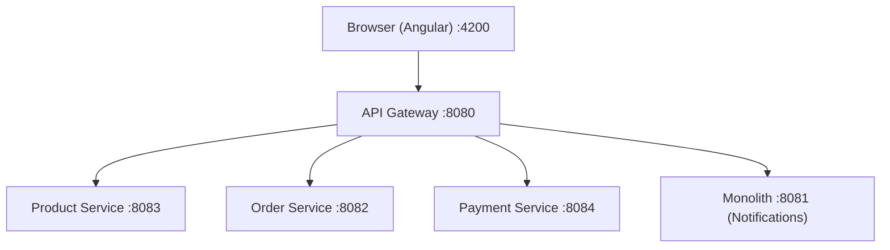
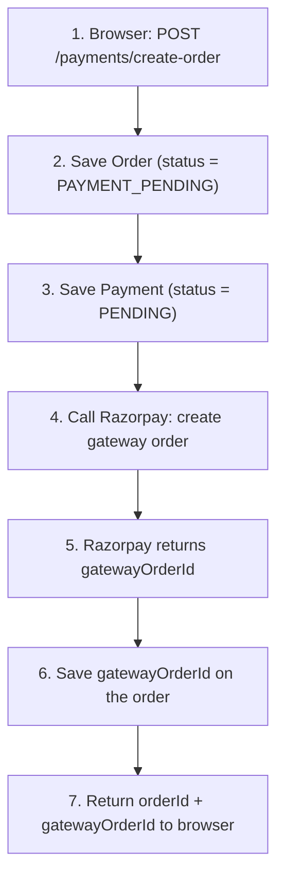
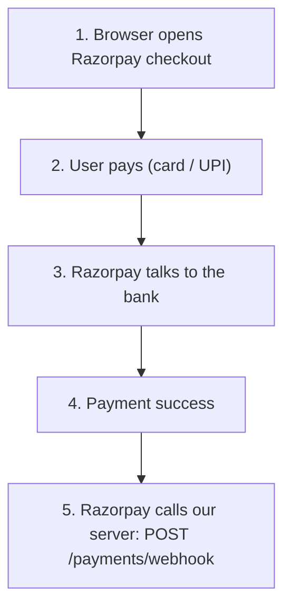
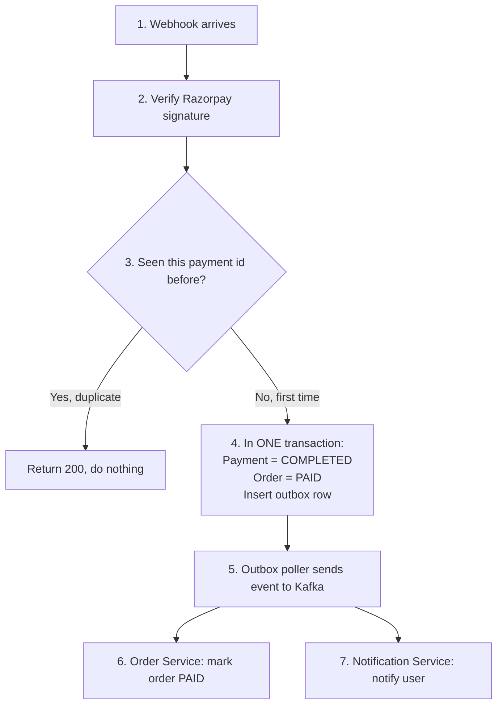
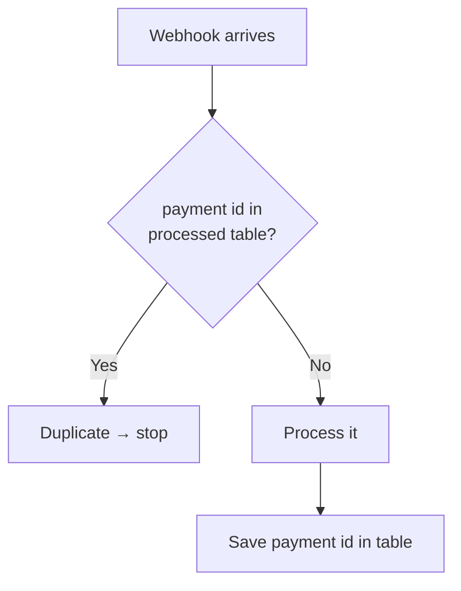
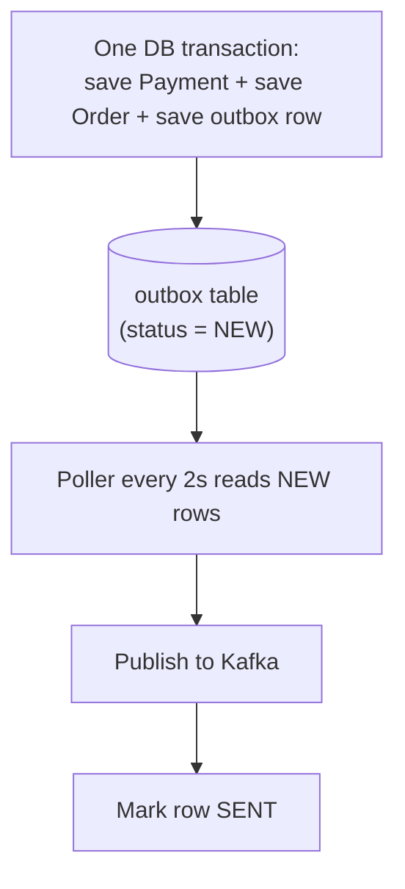
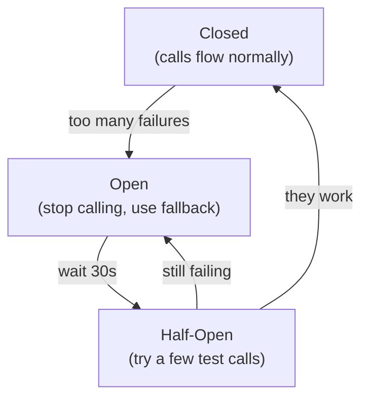
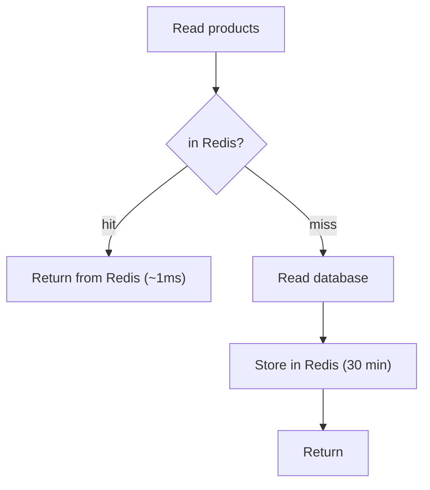
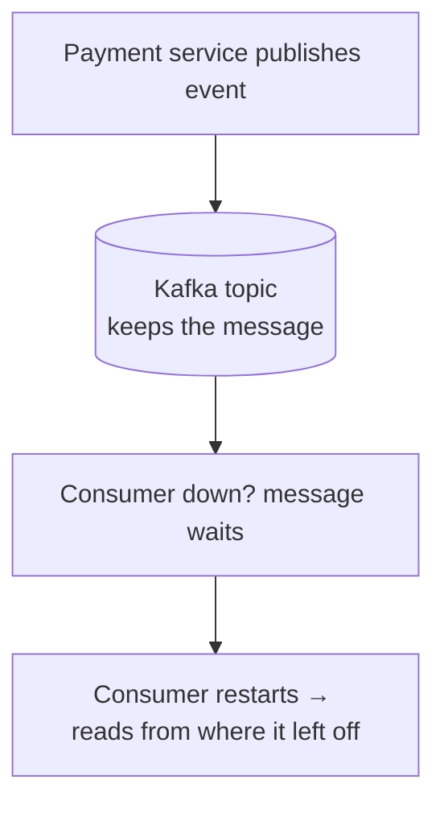
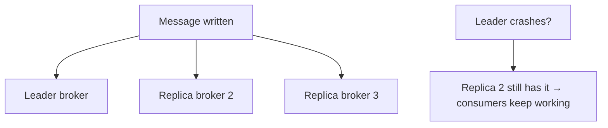

# EBusiness Platform — Study Guide

> Read this the way you write your own notes: **one phase at a time**. Each phase is a
> simple top-to-bottom flow, then a plain-English explanation. No giant diagrams, no
> crossing arrows. If you understand each small picture, you understand the whole system.

---

## How to read this guide

The whole payment journey is split into **3 phases**, exactly like your notebook:

1. **Phase 1 — Order Start** — user clicks Buy, we create the order and ask Razorpay for a payment.
2. **Phase 2 — Payment (async)** — user pays on Razorpay; Razorpay tells our server.
3. **Phase 3 — Backend Processing** — we verify, save safely, and tell the other services.

After the 3 phases, each important *pattern* (outbox, idempotency, circuit breaker, Redis,
Kafka) gets its **own tiny diagram + simple story**. Then scaling, edge cases, and interview
questions.

---

## The 4 services (the map)

One front door (Gateway). Each service does **one job**. This is the only "wide" diagram,
and it is a simple fan-out — no crossing arrows.



| Service | One-line job |
|---|---|
| Gateway :8080 | The only address the browser knows. Sends each URL to the right service. |
| Product :8083 | The catalog. Reads are cached in Redis. |
| Order :8082 | Owns orders. Marks an order PAID when payment succeeds. |
| Payment :8084 | Talks to Razorpay, checks webhooks, saves payment, sends events. |
| Monolith :8081 | Sends the "payment successful" notification. |

**Behind the services:** PostgreSQL (the real data), Redis (fast cache), Kafka (carries
messages between services).

---

## Phase 1 — Order Start

User clicks **Buy**. We set up the order and ask Razorpay for a payment. Straight line, top
to bottom.



**In plain words:**

1. The user clicks Buy. The browser sends a request to create a payment order.
2. We immediately write an **Order** row and mark it `PAYMENT_PENDING` — "this order exists but isn't paid yet."
3. We write a **Payment** row and mark it `PENDING`.
4. We call Razorpay's API and ask it to create a payment order on their side.
5. Razorpay replies with a **gatewayOrderId** (their id for this payment).
6. We save that id on our order so we can match them up later.
7. We send the ids back to the browser so it can open the checkout.

**Why PENDING first?** So we never lose track of an order. Even if the next step fails, the
order already exists in our database as "not paid." Nothing is invisible.

---

## Phase 2 — Payment happens (async)

Now the user actually pays. **This part happens on Razorpay, not on our server.** We just
wait for Razorpay to tell us the result.



**In plain words:**

1. Using the ids from Phase 1, the browser opens Razorpay's own secure checkout page.
2. The user types their card/UPI details **on Razorpay's page** — never on our server.
3. Razorpay talks to the bank to move the money.
4. The bank approves; the payment succeeds.
5. Razorpay sends a **webhook** (a server-to-server message) to our Payment service saying "this payment succeeded."

**Key idea:** card details never touch our server. That keeps us out of heavy security/PCI
scope. We only ever hear the *result* from Razorpay.

---

## Phase 3 — Backend Processing (the important one)

The webhook arrives. Now we must save the result **safely** and tell the other services. This
is the only phase with a decision (the idempotency check), and it's a simple yes/no.



**In plain words:**

1. Razorpay's webhook reaches our Payment service.
2. We **verify the signature** to be sure the message is really from Razorpay (details in the Security section).
3. We ask: *have we already processed this payment id?*
   - **Yes** → it's a duplicate (Razorpay sometimes retries). We just say "OK, already done" and stop.
   - **No** → first time, continue.
4. In **one database transaction** we mark the Payment `COMPLETED`, the Order `PAID`, and write an **outbox row** (the event). All three save together or none do.
5. A small background poller reads that outbox row and publishes a `payment-confirmed` event to Kafka.
6. The **Order service** hears the event and marks its order PAID.
7. The **Notification service** hears the same event and sends the user their message.

The next sections explain steps 3, 4, and 5 in more detail — they're the three patterns
interviewers love.

---

## Pattern 1 — Idempotency ("don't process twice")

**The problem:** Razorpay retries a webhook if our reply is slow. Same payment, sent twice.
If we process both, we could notify twice or deduct stock twice.

**The fix:** keep a table of payment ids we've already handled. Check it first.



**Simple story:** before doing any work, we ask the database "have I seen this id?" The id
column is **unique**, so even if two copies arrive at the exact same time, only one can be
saved — the other safely fails. This is called an **idempotent consumer**.

**One-line interview answer:** "The network can deliver the same message twice, so I make
processing it twice have the same result as once — a unique key on the payment id."

---

## Pattern 2 — Transactional Outbox ("don't lose the event")

**The problem:** saving to the database and sending to Kafka are two different systems. If we
save the payment, then crash before sending to Kafka, the order never gets marked PAID. The
event is **lost**.

**The fix:** don't send to Kafka directly. Write the event as a **row in the same database
transaction**. A separate poller sends it afterward.



**Simple story:** the event is saved *with* the payment, in the same transaction. So the
event can only exist if the payment really succeeded. If Kafka is down, the row just waits as
`NEW` and the poller retries every 2 seconds until it works. **Nothing is ever lost.**

**One-line interview answer:** "A database commit and a Kafka send can't be atomic together,
so I store the event in the database in the same transaction and publish it separately with
retries."

---

## Pattern 3 — Circuit Breaker ("protect ourselves from Razorpay")

**The problem:** Razorpay is outside our control. If it gets slow, every request piles up
waiting for it, and our own service runs out of threads and dies too. One outage becomes two.

**The fix:** a circuit breaker. Like an electrical fuse — if Razorpay keeps failing, we
"trip" and stop calling it for a while.



**Simple story:** while "Open," we don't call Razorpay at all — we instantly return a "payment
temporarily unavailable" message. This keeps our threads free and gives Razorpay room to
recover. After a short wait we test with a few calls; if they succeed, we go back to normal.

**One-line interview answer:** "The circuit breaker fails fast when a dependency is unhealthy,
so their outage doesn't drag my service down."

---

## Pattern 4 — Redis cache ("fast reads, cheaper database")

**The problem:** the product catalog is read constantly but changes rarely. Hitting the
database every time is slow and expensive.

**The fix:** keep catalog results in Redis (memory). Check Redis first.



**Simple story:** the first read goes to the database and fills the cache. Every read after
that comes from Redis in about a millisecond — no database work. When a product is created or
updated, we **clear** the cache so nobody sees old data. If Redis is down, we simply read the
database instead (we "fail open"), so the cache is never a single point of failure.

**How it saves money:** the database is the expensive, hard-to-scale part. If 9 out of 10
reads come from Redis, the database does one-tenth of the work → a smaller, cheaper database.

**One-line interview answer:** "Redis protects the database — every cache hit is a database
query I don't pay for, and it fails open so it's never a hard dependency."

---

## Pattern 5 — Kafka ("never lose a message between services")

Kafka is the messenger between services. Two things make it safe:

**1. Messages wait if a consumer is down.**



**2. Replication so a broker crash loses nothing** (this is the production part).



**Simple story:** Kafka writes each message to disk and keeps it. If a service is down, the
message sits in the topic and is read when the service comes back (it remembers its place
using an **offset**). In production Kafka runs as **3 brokers** and waits until at least 2
copies are saved before saying "done" — so if one broker dies, no message is lost. We also
only **acknowledge** a message after we've successfully processed it; if processing fails, we
don't acknowledge, and Kafka safely re-delivers (idempotency makes that safe).

**One-line interview answer:** "Kafka persists and replicates messages, and my consumers ack
only after success — so a crash means safe redelivery, never a lost event."

---

## Fault tolerance — the whole picture in one table

Every failure has a safety net. This table is the best thing to memorise.

| If this breaks... | What saves us |
|---|---|
| Kafka is down | Outbox row waits as NEW, retries every 2s |
| Server crashes mid-payment | Event is already a saved DB row; poller sends it after restart |
| Razorpay is slow / down | Circuit breaker fails fast to a fallback |
| Redis is down | Cache fails open → read from the database |
| Duplicate webhook | Idempotency table ignores the repeat |
| A consumer is down | Kafka keeps the message; it resumes from its offset |
| A Kafka broker crashes | Replicas still have the message |
| One service is down | The others keep working (they're decoupled) |

**The theme:** no single failure takes down the system, and nothing about money is ever
silently lost.

---

## High throughput — the simple math (44 → 2,000)

The throughput of a service is limited by its **database connection pool**:

```
throughput = pool size ÷ time each request holds a connection
```

- **Before:** the Razorpay call was **inside** the database transaction, so each request held
  a connection for ~450ms. With a 20-connection pool: 20 ÷ 0.450s ≈ **44 per second**.
- **After:** we moved the Razorpay call **outside** the transaction. Each request now holds a
  connection for only ~10ms. 20 ÷ 0.010s = **2,000 per second**.

Same hardware. We just stopped holding a database connection hostage while waiting on a slow
external call.

**One-line interview answer:** "The bottleneck wasn't CPU — it was holding a DB connection
during an external call. Shrinking that from 450ms to 10ms raised the ceiling ~45× by
Little's Law."

---

## "What if this were a huge bank?"

Same patterns, but bigger and safer. This shows you know demo-vs-production.

| Area | Our version (learning) | Bank version (production) |
|---|---|---|
| Database | 1 PostgreSQL | HA cluster + read replicas, sharded big tables, one DB per service |
| Kafka | 1 broker, 1h retention | 3+ brokers, replication factor ≥ 3, many partitions, long retention |
| Idempotency | Postgres table | Same idea + a full Saga with "undo" (compensating) steps |
| Deploy | run on a laptop | Kubernetes, auto-scaling, multi-region |
| Security | env-var secrets | Vault/KMS, mTLS between services, full audit logs (PCI-DSS) |
| Money correctness | order status | Double-entry ledger + daily reconciliation vs bank files |

**The sentence to say out loud:** "The patterns don't change — outbox, idempotency, circuit
breaker, cache-aside are the same at any size. What a bank adds is **redundancy, scale, and
money-correctness**: replicate everything, shard the big tables, add a ledger, reconcile
daily."

---

## Edge cases (these separate juniors from seniors)

1. **User closes the browser before we confirm.** The webhook still arrives server-to-server, so the order still gets marked PAID.
2. **Webhook and the user's confirm arrive out of order.** Idempotency makes the second one a no-op; the order ends PAID exactly once.
3. **Card charged but network drops before we hear back.** The webhook (or the daily reconciliation job) catches it later — settled exactly once.
4. **Duplicate webhook.** Ignored by the unique key.
5. **Redis has stale data after an update.** We clear the cache on every write; worst case the 30-minute expiry fixes it.
6. **Consumer crashes right after processing, before acking.** Redelivered on restart; idempotency makes reprocessing safe.
7. **Outbox row keeps failing to send.** It stays NEW with the error saved; we alert on old rows. The money state in the DB is already correct.
8. **Payment succeeds but notification fails.** The order is still correctly PAID; the notification retries on its own. We never let a small step corrupt the important one.

---

## Interview questions (with your answers)

**Q: Walk me through your payment flow.**
Phase 1 (create order, PENDING) → Phase 2 (user pays on Razorpay, it webhooks us) → Phase 3
(verify signature, idempotency check, one transaction that marks PAID + writes outbox,
poller publishes to Kafka, order and notification services react).

**Q: How do you make sure you never lose a payment event?**
Transactional outbox — the event is saved in the same transaction as the payment, and a
poller retries until Kafka accepts it.

**Q: Kafka can deliver twice. How do you avoid double-processing?**
Idempotent consumer with a unique key on the payment id — processing twice has the same
effect as once.

**Q: Why a circuit breaker?**
So a slow Razorpay can't drag my service down. It fails fast to a fallback, then recovers.

**Q: Why Redis and how does it save cost?**
Cache-aside on catalog reads. It protects the database (the expensive part) and fails open so
it's never a hard dependency.

**Q: When do you use sync vs async?**
Sync when the user is waiting for the answer; async (Kafka) when the work can happen slightly
later and I want services decoupled.

**Q: What's your biggest single point of failure?**
Today, the shared database and single Kafka broker. Fix: a database per service with HA, and
a replicated Kafka cluster. (Saying this honestly scores points.)

---

## Mini-glossary

- **Idempotent** — doing it twice gives the same result as once.
- **Outbox** — an events table written in the same transaction as the data, sent later.
- **Cache-aside** — check cache, on miss read DB and fill the cache.
- **Circuit breaker** — stop calling a failing dependency to protect yourself.
- **Offset** — Kafka's bookmark of what a consumer has read.
- **Replication factor** — how many broker copies of each message Kafka keeps.
- **Reconciliation** — daily check of our records against the bank's file.
- **Little's Law** — throughput = concurrency ÷ time-per-item.

---

## Last word

Study it phase by phase, small picture by small picture. When each little diagram feels
*obvious* — not memorised, obvious — you've understood the system. You built this. Now you
just have to say it out loud, calmly, one phase at a time. You've got this.
